<picture>
  <source media="(prefers-color-scheme: dark)" srcset="./assets/dark.svg">
  <source media="(prefers-color-scheme: light)" srcset="./assets/light.svg">
  
</picture>

 

&nbsp;&nbsp;&nbsp;&nbsp;

 

## About

AI Engineer and founder based in Jaipur, India, currently pursuing a BCA at Poornima University (2025–2028). I build production AI systems end to end — from computer vision pipelines to automation platforms shipped to paying clients — and hold Anthropic Academy certifications in agentic AI development.

## Ventures

**Growady** — AI marketing automation for local service businesses. Co-founder.
Missed-call text-back, AI appointment reminders, lead follow-up, review automation, and reactivation campaigns. Built on GoHighLevel, n8n, Twilio, Voiceflow, and Bland AI.

## Selected Projects

| Project | Description | Stack |
|---|---|---|
| **FaceRead** | Facial Emotion Recognition system, built as a team lead project at Poornima University | YOLOv5, FER2013 |
| **AI Operations System** | Operations tooling built for Curious Cubs Innovation | Claude API, n8n |
| **CV Gesture Demo** | Real-time hand-gesture recognition demo | Python, OpenCV, MediaPipe |

## Certifications

Anthropic Academy — AI Fluency for Students · Introduction to Agent Skills · Claude Code in Action · Introduction to Subagents

## Stack

## Stats

## Contribution Snake

<picture>
  <source media="(prefers-color-scheme: dark)" srcset="https://raw.githubusercontent.com/Manupratap29/Manupratap29/output/snake-dark.svg">
  <source media="(prefers-color-scheme: light)" srcset="https://raw.githubusercontent.com/Manupratap29/Manupratap29/output/snake-light.svg">
  
</picture>

 

Banner portrait rendered as a dot-density silhouette from a single source photo — Python (Pillow/NumPy/SciPy), Floyd–Steinberg serpentine dithering, ordered-halftone fill.

 

---

<b>⚙ Setup checklist (do this once, by hand)</b>

 

**1. Swap the dummy links**
Replace every `-dummy` LinkedIn/Instagram/Facebook/email/portfolio URL above with your real ones.

**2. Upload the banner assets**
Put `dark.svg` and `light.svg` in an `assets/` folder in this repo (`Manupratap29/Manupratap29`) so the `<picture>` tag at the top resolves.

**3. Self-host the stats cards** — the public `github-readme-stats` instance rate-limits constantly, so don't skip this:
- GitHub → Settings → Developer settings → Tokens (classic) → Generate new (classic) → scope: `repo` → No expiration. Copy it immediately, never paste it anywhere public.
- Fork [`anuraghazra/github-readme-stats`](https://github.com/anuraghazra/github-readme-stats).
- [Vercel](https://vercel.com) → sign up with GitHub → Hobby (free) → Add New Project → import your fork.
- In the Vercel project, add environment variable `PAT_1` = the token from step 1 → Deploy.
- Replace every `github-readme-stats-dummy.vercel.app` above with your new Vercel instance URL.

**4. Add the contribution snake workflow**
Create `.github/workflows/snake.yml` in this repo with the following content:

\`\`\`yaml
name: Contribution Snake

on:
  schedule:
    - cron: "0 */12 * * *"
  workflow_dispatch:
  push:
    branches:
      - main

permissions:
  contents: write

jobs:
  generate:
    runs-on: ubuntu-latest
    steps:
      - uses: actions/checkout@v4

      - name: Generate snake SVGs
        uses: Platane/snk/svg-only@v3
        with:
          github_user_name: Manupratap29
          outputs: |
            dist/snake-dark.svg?color_snake=#A78BFA&color_dots=#2d3343,#3a4358,#5b6786,#7C3AED,#A78BFA
            dist/snake-light.svg?color_snake=#7C3AED&color_dots=#EDE9FE,#DDD6FE,#C4B5FD,#7C3AED,#5B21B6

      - name: Push to output branch
        uses: crazy-max/ghaction-github-pages@v3.1.0
        with:
          target_branch: output
          build_dir: dist
        env:
          GITHUB_TOKEN: \${{ secrets.GITHUB_TOKEN }}
\`\`\`

Note: the dark snake's empty-cell color is `#2d3343`, not near-black — against GitHub's `#0d1117` background a near-black empty cell disappears and the grid looks broken.

**5. Enable workflow permissions** (this repo's settings, not your account settings)
Settings → Actions → General → Workflow permissions → **Read and write permissions**.

**6. Let it run once**
Push to `main`, wait for the Action to go green in the Actions tab — the `output` branch the snake images point to doesn't exist until it does.

